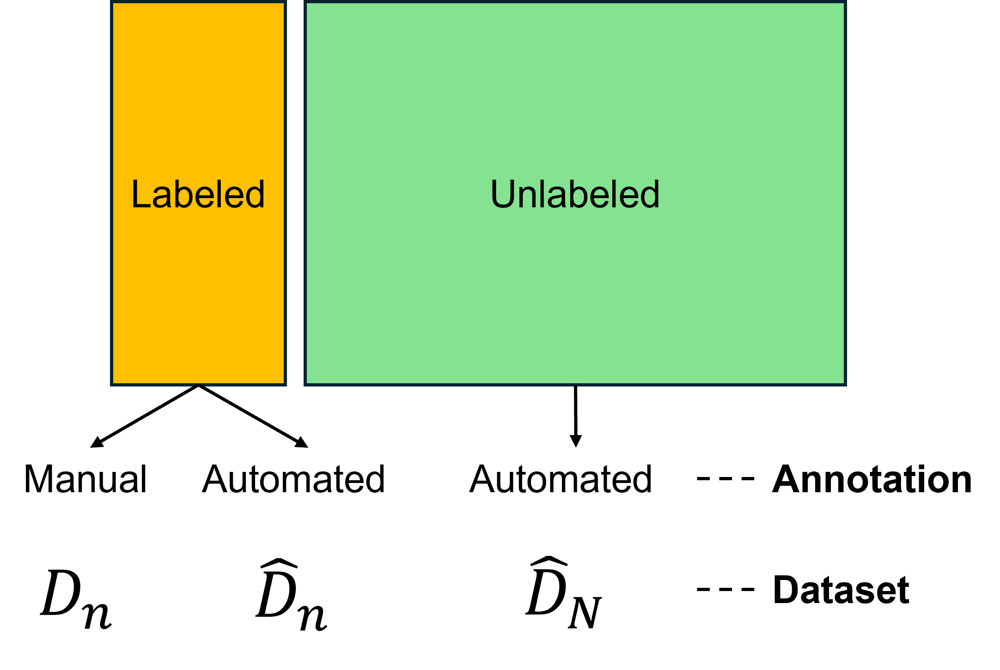

### Brief overview

What is the key bottleneck of typical supervised learning? 
Most common one is the curation of manual annotations(usually called labeling), and it is especially challenging for tasks involving dense predictions(e.g., segmentation). Cell segmentation for spatial transcriptomics [poses a significant challenge](https://www.nature.com/articles/s41588-025-02343-7) for downstream analysis, as it can be error-prone and inherently hard to mitigate bias.

[CSDE](https://www.biorxiv.org/content/10.64898/2026.01.15.699786.abstract) decomposes this challenge into two intertwined components: (1) difficulty in curating manual annotations and (2) potential errors in curated annotations.
To address these challenges, CSDE leverages the full usage of error-prone labels automatically generated from model predictions. 
For the first challenge, they implement an interface to accept, modify labels(not supporting modification of segmentation contours), or reject an invalid pair of (segmentation, label) to efficiently curate a small, but high-fidelity dataset. 

Consequently, prediction-powered inference (PPI) provides a statistical framework for valid estimation of parameters by leveraging a small, curated dataset and imputations from a large, unlabeled dataset, addressing the second challenge.

Regarding the increasing attention to the interactive frameworks utilizing human feedback, CSDE seems to be an important case of how quantitative analysis of biological measurements could be efficiently refined by human intervention. Technical details are described as follows.

### Technical details

Key technical details of CSDE include: (1) validity of naive PPI, (2) validity of importance sampling, and (3) choice of lambda_g specified by theorems from PPI++.
I've discussed some details related to PPI in my [previous post](https://hahajjjun.github.io/annotated%20bi/2025/09/21/causal-fm.html).

---

**Problem setup**

- Log fold change parameters for gene $g$ = $b^g$
- Cell type label for cell $i = Y^i$
- Expression of gene $g$ for cell $i=X_{ig}$ (quantified from segmentation contours)

---

**Validity of Naive PPI in CSDE**

CSDE is built on [Prediction-Powered Inference (PPI)](https://www.science.org/doi/10.1126/science.adi6000), which combines:

- A **large automated dataset** (high power, potentially biased),
- A **small manually curated dataset** (low bias, higher variance).

The core statistical task is estimating gene-specific log-fold changes (LFCs) using a GLM.

The CSDE estimator maximizes a **prediction-powered objective** rather than the naive likelihood.

CSDE maximizes a **prediction-powered objective**: $\hat{\beta} _g = arg max _{b^g} \mathcal{J}_g(b^g)$. 

This objective is specified as follows:

$$\mathcal{J}_g(b^g) =\lambda_g \mathcal{L}^g_{\hat{D}_N} (b^g) + (\mathcal{L}^g_{D_n}(b^g)-\lambda_g \mathcal{L}^g_{\hat{D}_N}(b^g))$$

This is an unbiased estimator of the expected log-likelihood. Additionally, CSDE problem setup(differential expression) can be understood as hypothesis testing in GLM, thus Theorem 1 from [PPI++](https://arxiv.org/abs/2311.01453) guarantees **consistency and asymptotic normality** of the PPI estimator. 

---

**Validity of Importance Sampling in CSDE**

CSDE does not necessarily sample curated cells uniformly. Instead, it may use **importance sampling** to prioritize cells that are more informative.

The adjusted objective function is as follows:

$$\mathcal{J}_g(b^g) =\lambda_g \mathcal{L}^g_{\hat{D}_N} (b^g) + (\sum_{i=1}^n\eta_i \log p(X_{ig}|Y_i;\beta^g) -\lambda_g (\log p(\hat{X}_{ig}|\hat{Y_i};\beta^g))$$

CSDE defines weights to prioritize cell type of interest(actually, they are “predicted” to be the cell type of interest via an automated pipeline), which are more likely to be sampled, specifically aiming at approximately one-third of the cells are ensured to be target cell types(e.g., T cells).
This heuristic could be simple and effective, but from my personal perspective, I wonder whether this process could be done with a more principled approach.

By the way, this approach is still valid since the automated dataset term converges to the population expectation via the law of large numbers, and the reweighted curated term provides an unbiased estimate of the population discrepancy. Each term converges in probability to the expectation under the unweighted distribution(by LLN and SNIS(self-normalized importance sampling) consistency, respectively).

---

**Choice of $\lambda_g$, theories from PPI++ paper**

The parameter $\lambda_g$ balances the imputed likelihood from the large automated dataset and the correction term from curated data.
Proposition 2. of PPI++ shows that there exists an optimal value minimizing the total asymptotic variance of the entire parameter vector.

However, in CSDE, the parameter of interest is a single coefficient $\beta_k^g$(for cell type $k$), thus it is natural to choose $\lambda$ to minimize the asymptotic variance of $\hat{\beta_k^g}$.

By taking the $k$th term of the asymptotic variance of the full parameter specified from the PPI++ paper, we can yield a closed-form solution(see Supplementary Methods C.2 for details).
