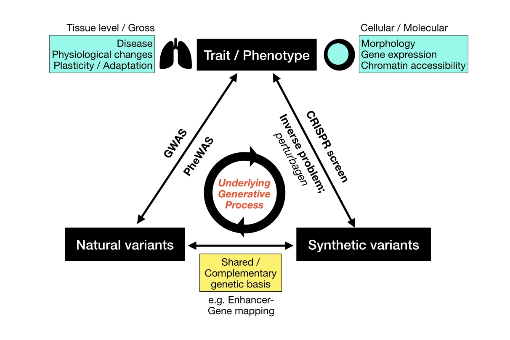

Updated on February, 2025

## About

Undergraduate student @ Yonsei University, College of Medicine.

- Study **generative processes** of biological measurements obtained from high-throughput methods. 
- Both interested in **top-down & bottom-up** approaches with mechanistic insights.

</img>

## Personal experiences
- [International Chemistry Olympiad(IChO)](https://icho2020.tubitak.gov.tr/) at Turkey, Silver medal `Jun 2020`
- Internship at [TGILAB](https://www.tgilab.org/), Yonsei University, Seoul, Republic of Korea `Jun 2021 ~ Aug 2021` `Dec 2021 ~ Feb 2022`
- Internship at [Korea Quantum Computing Co.](https://www.kqchub.com/), Busan, Republic of Korea `Jun 2022 ~ Aug 2022`
- Research associate at [MoNET](http://neuroimage.yonsei.ac.kr/), Yonsei University, Seoul, Republic of Korea `Mar 2022 ~ Oct 2023`
- Research associate at [Hwang LAB](https://sites.google.com/view/bhwanglabyonsei/), Yonsei University, Seoul, Republic of Korea `Oct 2023 ~ Jan 2025`

## Publications
1. **Multiplexed multimodal single-cell technologies: From observation to perturbation analysis**   Su-Hyeon Lee, **Junha Park**, Byungjin Hwang* [[paper]](https://doi.org/10.1016/j.mocell.2024.100147)
