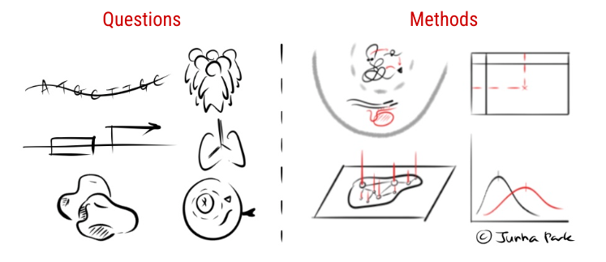

Updated on January, 2026

## About

M.D. Candidate @ Yonsei University, College of Medicine.

Studying **generative processes** of high-throughput biological measurements.

---

## Publications
- **Multiplexed multimodal single-cell technologies: From observation to perturbation analysis**   Su-Hyeon Lee, **Junha Park**, Byungjin Hwang* (2024, Molecules and Cells) [[paper]](https://doi.org/10.1016/j.mocell.2024.100147)

---

## Research experiences
- Internship at [TGILAB](https://www.tgilab.org/), Yonsei University, Seoul, Republic of Korea `Jun 2021 ~ Aug 2021` `Dec 2021 ~ Feb 2022`
- Internship at [Korea Quantum Computing Co.](https://www.kqchub.com/), Busan, Republic of Korea `Jun 2022 ~ Aug 2022`
- Research associate at [MoNET](http://neuroimage.yonsei.ac.kr/), Yonsei University, Seoul, Republic of Korea `Mar 2022 ~ Oct 2023`
- Research associate at [Hwang LAB](https://sites.google.com/view/bhwanglabyonsei/), Yonsei University, Seoul, Republic of Korea `Oct 2023 ~ Jan 2025`

## Awards
- Silver medal at [International Chemistry Olympiad(IChO)](https://icho2020.tubitak.gov.tr/) `Jun 2020`
- Severance Academic Award `May 2022`
- Severance Academic Award `May 2023`
- Yoo-Il Han Best Poster Award at Yonsei Medical Students' Colloquium `Sep 2023`
- Best Presentation Award at Biomedical Science Research Festival `Nov 2024`

---

## Posts

**Computational** Biology
- [Coalescing causal inference and foundation models](https://hahajjjun.github.io/annotated%20bi/2025/09/21/causal-fm.html)
- [Backpropagation through the NMF block](https://hahajjjun.github.io/annotated%20bi/2025/12/14/backprop-nmf.html)

Computational **Biology**
- [Unified perspective on GRN inference with external knowledge](https://hahajjjun.github.io/annotated%20bi/2025/03/07/unified-grn-inference.html)
- [Collection of genes: A sc-linker case study](https://hahajjjun.github.io/annotated%20bi/2025/07/02/gene-collections.html)
- [Foundation Models, Surrogate Biology](https://hahajjjun.github.io/annotated%20bi/2025/09/06/fm-sb.html)
- [Nature's Language Processing](https://hahajjjun.github.io/annotated%20bi/2025/11/22/nlp.html)
- [Anatomy of Biological Sequence Modeling](https://hahajjjun.github.io/annotated%20bi/2026/01/03/anatomy-of-bsm.html)
